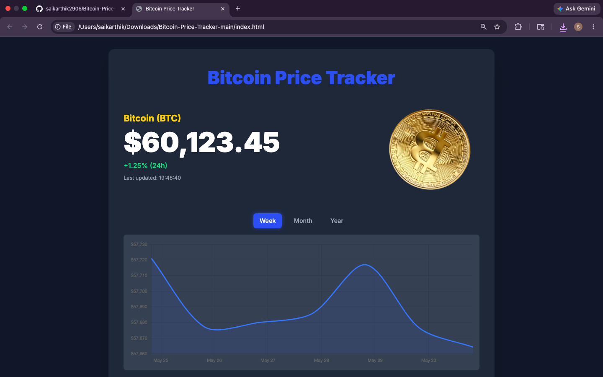

# ₿ Bitcoin Price Tracker

A modern and responsive **Bitcoin Price Tracker** that displays live BTC prices in **INR** and **USD**, interactive historical charts, real-time conversion tools, and auto-refreshing market data using the **CoinGecko Public API**.

Designed with a sleek crypto-inspired UI featuring animated visuals and responsive components.

---

## 🛠 Tech Stack


---

## 📁 Project Structure

```bash
bitcoin-price-tracker/
│
├── index.html        # Main UI page
├── style.css         # Custom styles + rotation animation
├── script.js         # Chart, INR price & converter logic
├── bitcoin.png       # Rotating Bitcoin logo
└── README.md         # Project documentation
```

---

# Screenshots




---
## 🚀 Features

### 📈 Live Bitcoin Price Tracking

* Displays real-time BTC price in INR
* Simulated USD price display
* Auto-refreshes market data every few seconds

### 📊 Interactive Price Charts

* Historical Bitcoin price visualization
* Toggle between:

  * Weekly chart
  * Monthly chart
  * Yearly chart

### 💱 BTC ⇄ INR Converter

* Convert Bitcoin to INR instantly
* Reverse INR to BTC conversion support
* Dynamic calculations using live market price

### 🔄 Animated Bitcoin UI

* Rotating Bitcoin logo animation
* Smooth responsive layout
* Crypto-inspired dark theme

### 📱 Responsive Design

Built using Tailwind CSS for seamless experience across:

* Desktop
* Tablet
* Mobile devices

---

## 🌐 API Integration

This project uses the free public API from **CoinGecko**.

Features powered by the API:

* Live BTC market price
* Historical chart data
* Currency conversion calculations

No API key required.

---

## ⚙️ Usage

Simply open:

```bash
index.html
```

in any browser.

No installation or backend server required.

---

## 🎯 Purpose of the Project

This project demonstrates:

* Real-time API integration
* Interactive financial dashboards
* Cryptocurrency data visualization
* Frontend animation techniques
* Responsive UI development
* JavaScript DOM manipulation

Perfect for:

* Frontend portfolio projects
* Crypto dashboard demos
* JavaScript practice
* UI/UX showcases
* API integration learning

---

## 👨‍💻 Author

**Sai Karthik**

